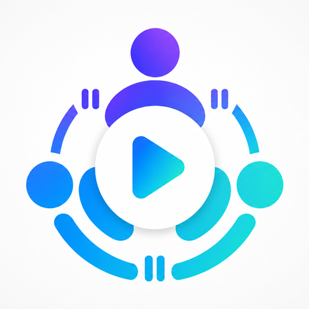

# WeWatch

<p align="center">
  
</p>

WeWatch helps friends watch local media together. This Windows Electron app can host a watch session, and both Windows and Android clients can connect, share playback state, and keep VLC in sync.

The app does not stream video files. Everyone should have the same media available locally, then WeWatch syncs play, pause, seek, and timeline position.

> Looking for the Android companion app? See [WeWatch-Android](https://github.com/RaoNatu/WeWatch-Android).

## Features

- Host or join a watch session over WebSockets.
- Sync play, pause, seek, file changes, and timeline position.
- Show connected people, playback state, latency, and drift.
- Auto-follow the host timeline when a member falls behind or jumps ahead.
- Control VLC from the Windows app.
- Connect Android phones to the Windows host.
- Build a shareable Windows installer.
- Show app versions and check GitHub Releases for updates.

## Requirements

- Windows
- Node.js and npm
- VLC Media Player

VLC desktop should be installed in one of the default locations:

- `C:\Program Files\VideoLAN\VLC\vlc.exe`
- `C:\Program Files (x86)\VideoLAN\VLC\vlc.exe`

## Setup

Install dependencies from the repository root:

```bash
npm install
```

Run the Windows Electron app in development:

```bash
npm start
```

Build the Windows installer:

```bash
npm run build
```

The installer is generated at:

```text
dist/WeWatch-Setup-1.0.0.exe
```

Send that `.exe` file to friends. It creates normal desktop and Start Menu shortcuts named `WeWatch`.

When publishing an update, also keep the generated `.blockmap` and `latest.yml` files from `dist/`. The Windows updater needs those release assets.

## Versioning

Set the Windows app version:

```bash
npm run version:set -- 1.0.3
```

This updates `package.json` and `package-lock.json`. The Android app has its own version in its [own repository](https://github.com/RaoNatu/WeWatch-Android).

## Release Workflow

For every new release:

1. Set the version:

```bash
npm run version:set -- 1.0.3
```

2. Test the app.
3. Commit and push the code.
4. Build:

```bash
npm run build
```

5. Create a GitHub Release named/tagged `v1.0.3`.
6. Upload these files to that release:

```text
dist/WeWatch-Setup-1.0.3.exe
dist/WeWatch-Setup-1.0.3.exe.blockmap
dist/latest.yml
```

Important notes:

- The version must go up every release, or users will not be offered an update.
- Windows auto-update works in the installed app, not in `npm start`.
- A public GitHub repo does not need a token for users to receive updates.

## How To Use

### Host From Windows

1. Open WeWatch on Windows.
2. Enter your name.
3. Click `Launch VLC`, or open VLC manually with the HTTP interface enabled.
4. Keep the session port as `3000`, unless you need a different port.
5. Click `Start hosting`.
6. Allow Windows Firewall access on your private network if prompted.
7. Share your Windows PC IPv4 address and port with friends.

### Join From Windows

1. Open WeWatch on another Windows computer.
2. Enter the host IP address and port.
3. Click `Join host`.
4. Open the same media file in VLC.
5. Use play, pause, seek, or `Sync` to stay aligned.

### Join From Android

1. Install VLC for Android.
2. Start hosting from the Windows app.
3. Install [WeWatch-Android](https://github.com/RaoNatu/WeWatch-Android) on your phone.
4. Make sure the phone and Windows host are on the same Wi-Fi/network.
5. In the Android app, enter the Windows host IP address and port.
6. Enable Remote Access in VLC for Android and note the Remote Access URL plus OTP/password.
7. Enter the VLC Remote Access details in the Android app.
8. Open the same media in VLC for Android, or use `Send file to VLC`.
9. Tap `Join Windows`.

Default connection values:

- WeWatch session server: `ws://<Windows IP>:3000`
- Windows VLC: `127.0.0.1:8080`
- Windows VLC default password: `1234`

## Project Structure

```text
src/
  assets/       Windows app logo used by Electron
  main/         Electron main process, VLC bridge, and session server
  renderer/     Windows app UI, socket client, and sync behavior

build/          Windows installer icon resources
dist/           Generated Windows installer output
```

## Packaging Notes

The Windows installer uses:

- `build/icon.ico` for the app and installer icon
- `src/assets/icon.png` for the running Electron window and UI logo

Generated outputs are ignored by git, including `dist/`, `.exe`, and `.blockmap` files.

## Scripts

```bash
npm start
npm run build
npm run dist
npm run version:set -- 1.0.3
```

## Troubleshooting

- If VLC is not reachable on Windows, confirm VLC is installed and the HTTP interface is running on port `8080`.
- If sync works but video differs, make sure every device opened the same media file.
- If Android cannot connect, check that both devices are on the same network and Windows Firewall allows TCP port `3000`.

## Graphify

This repository uses [Graphify](https://github.com/anomalyco/graphify) to generate a code knowledge graph for faster codebase navigation.

The generated graph lives in `graphify-out/`. If it's stale, update it:

```bash
graphify update .
```

You can then explore the graph structure through `graphify-out/graph.html` in a browser.

## License

ISC
